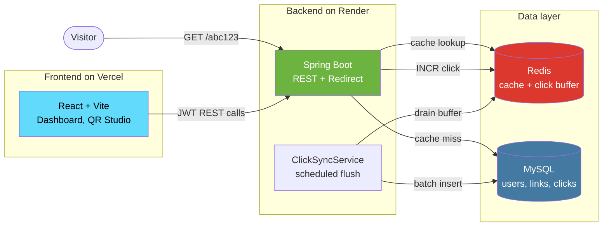
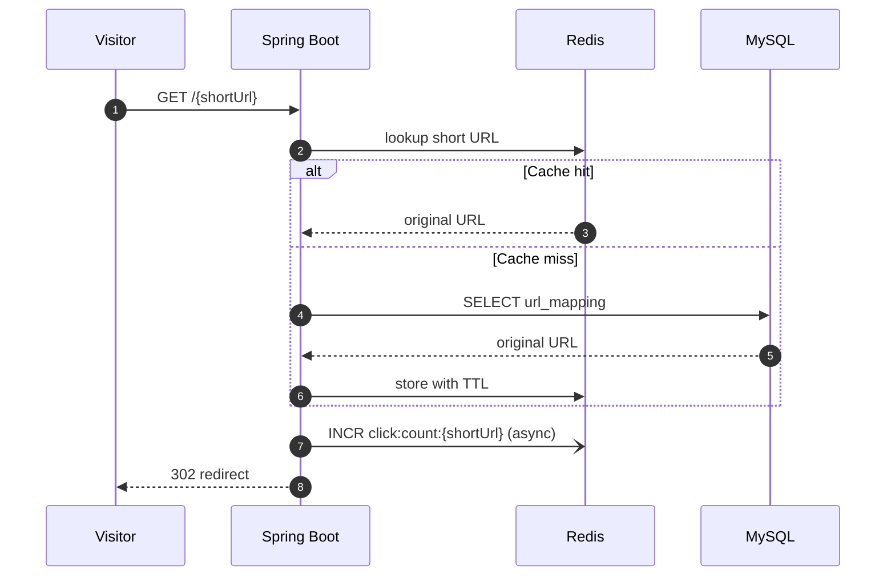
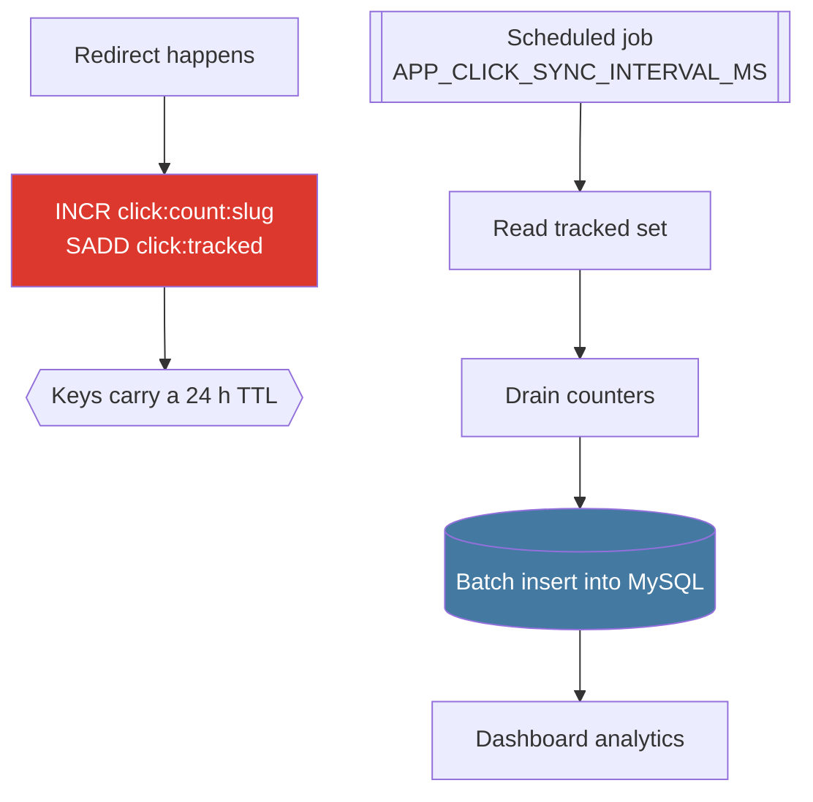
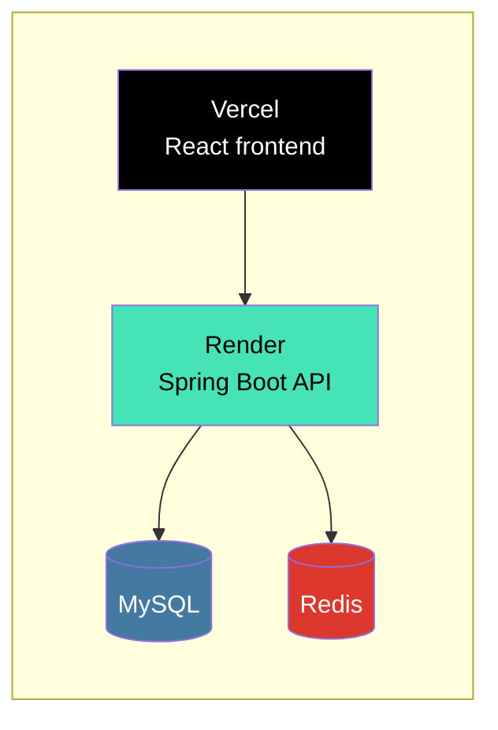

<div align="center">


# Sutra

### A full stack URL shortener with authentication, live analytics, Redis backed redirects, and a customizable QR Studio.

<p>


</p>

<p>


</p>

</div>

---

## Contents

| Section | What is inside |
| :--- | :--- |
| [Overview](#overview) | What Sutra does and how the repo is laid out |
| [Features](#features) | Everything the app can do today |
| [Architecture](#architecture) | System diagram and request flows |
| [Tech Stack](#tech-stack) | Libraries and services in use |
| [API Reference](#api-reference) | Endpoint table |
| [Getting Started](#getting-started) | Run it locally in three steps |
| [Environment Variables](#environment-variables) | Backend and frontend config |
| [Deployment](#deployment) | How it is hosted |
| [Notes](#notes) | Behaviour worth knowing |

---

## Overview

Sutra turns long links into short, shareable ones, then tells you what happened to them. Every link gets a dashboard entry, a click history, and its own designable QR code.

The repository holds two applications:

```
url-shortener-project/
├── url-shortener-sb/        # Spring Boot backend  (Java 21, MySQL, Redis)
└── url-shortener-react/     # React frontend       (Vite, TypeScript, Tailwind)
```

---

## Features

<table>
<tr>
<td width="50%" valign="top">

### Links

- Register and log in with JWT authentication
- Create short URLs in one click
- Optional custom slugs for branded links
- Personal dashboard to manage every link
- Instant redirects served from a Redis cache

</td>
<td width="50%" valign="top">

### Analytics

- Per link click history
- All time dashboard with daily, weekly, and monthly bucketing
- Total clicks across every link you own
- Clicks buffered in Redis, then synced to MySQL in batches
- Area charts rendered with Recharts

</td>
</tr>
<tr>
<td width="50%" valign="top">

### QR Studio

- Live QR preview inside the dashboard
- Quick theme presets
- Foreground and background color pickers
- Pattern and corner style controls
- Square, rounded, and circular frames
- Logo upload with size control
- Adjustable export resolution and PNG download
- Spotify link detection with Spotify Code export

</td>
<td width="50%" valign="top">

### Platform

- Graceful splash screen for backend cold starts
- Adaptive backend health polling
- Redis start up diagnostics and safe fallback
- Scheduled cache eviction to stay inside free tier memory
- Responsive UI with dark friendly styling

</td>
</tr>
</table>

---

## Architecture



### Redirect path

A redirect never waits on MySQL when the link is already cached, and never writes to MySQL at all.



### Click buffering

Writes are the expensive part of a redirect, so they are batched instead of happening one row at a time.



> **Why batch:** storing every click as its own timestamped row would grow without bound and exhaust a free tier Redis quota. Sutra stores counters only, and the sync job stamps each batch with its flush time, which keeps daily level analytics accurate.

---

## Tech Stack

| Layer | Technology |
| :--- | :--- |
|  Frontend | React 18, TypeScript, Vite, React Router |
|  Styling | Tailwind CSS, shadcn/ui, Radix UI, Framer Motion |
|  Charts and QR | Recharts, Chart.js, qr-code-styling, qrcode.react |
|  Backend | Java 21, Spring Boot, Spring Security, Spring Data JPA |
|  Auth | JWT bearer tokens, BCrypt password hashing |
|  Database | MySQL 8 |
|  Cache | Redis for redirect caching and click buffering |
|  Testing | Vitest, Testing Library, Playwright |

---

## API Reference

All endpoints are prefixed by the backend base URL. Everything under `/api/urls` requires an `Authorization: Bearer <token>` header.

| Method | Endpoint | Auth | Description |
| :--- | :--- | :---: | :--- |
| `POST` | `/api/auth/public/register` | No | Create an account |
| `POST` | `/api/auth/public/login` | No | Log in and receive a JWT |
| `POST` | `/api/urls/shorten` | Yes | Create a short URL, optionally with a custom slug |
| `GET` | `/api/urls/myurls` | Yes | List every link owned by the user |
| `GET` | `/api/urls/analytics/{shortUrl}` | Yes | Click events for one link between two timestamps |
| `GET` | `/api/urls/totalClicks` | Yes | Clicks per day across all of the user's links |
| `GET` | `/{shortUrl}` | No | Redirect to the original URL |

<details>
<summary><b>Example: create a short URL</b></summary>

```bash
curl -X POST http://localhost:8080/api/urls/shorten \
  -H "Authorization: Bearer $TOKEN" \
  -H "Content-Type: application/json" \
  -d '{"originalUrl":"https://example.com/a/very/long/path","shortUrl":"my-slug"}'
```

```json
{
  "id": 12,
  "originalUrl": "https://example.com/a/very/long/path",
  "shortUrl": "my-slug",
  "clickCount": 0,
  "createdDate": "2026-09-11T18:04:22"
}
```

Leave `shortUrl` out of the request body to get a generated slug instead.

</details>

<details>
<summary><b>Example: fetch analytics for one link</b></summary>

```bash
curl -G http://localhost:8080/api/urls/analytics/my-slug \
  -H "Authorization: Bearer $TOKEN" \
  --data-urlencode "startDate=2026-09-01T00:00:00" \
  --data-urlencode "endDate=2026-09-11T23:59:59"
```

`/api/urls/totalClicks` takes plain dates instead, for example `startDate=2026-09-01`.

</details>

---

## Getting Started

### Prerequisites

| Requirement | Version |
| :--- | :--- |
| Java | 21 |
| Node.js and npm | 18 or newer |
| MySQL | running locally or remotely |
| Redis | running locally or remotely |

### 1. Start MySQL and Redis

Both must be reachable before the backend boots. A local Redis URL looks like this:

```bash
redis://localhost:6379
```

### 2. Start the backend

```bash
export DB_URL=jdbc:mysql://localhost:3306/urlshortenerdb
export DB_USERNAME=root
export DB_PASSWORD=your_password
export JWT_SECRET=your_secret
export FRONTEND_URL=http://localhost:5173
export REDIS_URL=redis://localhost:6379

cd url-shortener-sb
./mvnw spring-boot:run
```

The backend serves `http://localhost:8080`.

### 3. Start the frontend

Create `url-shortener-react/.env`:

```env
VITE_BACKEND_URL=http://localhost:8080
```

Then run:

```bash
cd url-shortener-react
npm install
npm run dev
```

The frontend serves `http://localhost:5173`.

### Frontend scripts

| Command | What it does |
| :--- | :--- |
| `npm run dev` | Start the Vite dev server |
| `npm run build` | Production build |
| `npm run preview` | Preview the production build |
| `npm run lint` | Run ESLint |
| `npm test` | Run the Vitest suite |

---

## Environment Variables

### Backend (`url-shortener-sb`)

| Variable | Required | Description |
| :--- | :---: | :--- |
| `DB_URL` | Yes | JDBC URL for MySQL |
| `DB_USERNAME` | Yes | MySQL username |
| `DB_PASSWORD` | Yes | MySQL password |
| `JWT_SECRET` | Yes | Secret used to sign JWTs |
| `FRONTEND_URL` | Yes | Frontend origin allowed by CORS |
| `REDIS_URL` | Yes | Redis connection URL |
| `APP_CLICK_SYNC_INTERVAL_MS` | No | Override the click sync interval, in milliseconds |

### Frontend (`url-shortener-react`)

| Variable | Required | Description |
| :--- | :---: | :--- |
| `VITE_BACKEND_URL` | Yes | Backend base URL, for example `http://localhost:8080` |

---

## Deployment



| Component | Host |
| :--- | :--- |
| Frontend | Vercel |
| Backend | Render |
| Database | MySQL |
| Cache and click buffer | Redis |

---

## Notes

- **Redis is required.** Caching and click buffering are active parts of the request path, not optional extras. If Redis errors, the backend logs it and falls back safely rather than failing the user's request.
- **Click totals update in batches.** Analytics are written to MySQL on the configured sync interval, so a fresh click may take a moment to show up in the dashboard.
- **Cold starts are expected on free hosting.** The frontend shows a splash screen and polls the backend until it wakes up.

---

<div align="center">

Built by <a href="https://github.com/AbhayKale332">AbhayKale332</a>

</div>
